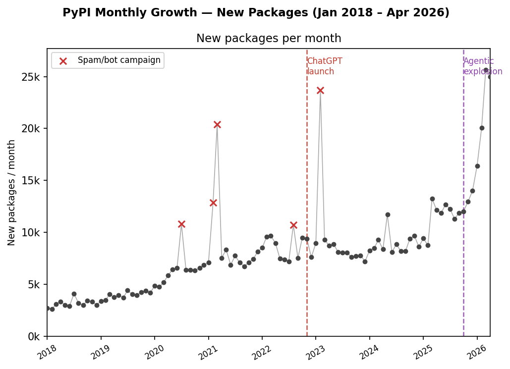
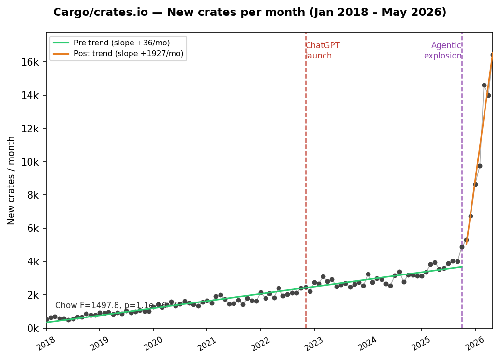

# The Cambrian Explosion of Software

Experimental data around the post-2025 growth of codingand software.

- `pypi/`: PyPI package and release growth analysis.
- `rust/`: crates.io crate and version growth analysis.
- `github/`: GitHub-wide commit counting scripts and generated chart.
- `claude-code/`: Claude Code-attributed GitHub commit counting scripts and CSV outputs.

Large raw dumps are intentionally not committed.

## Figures

