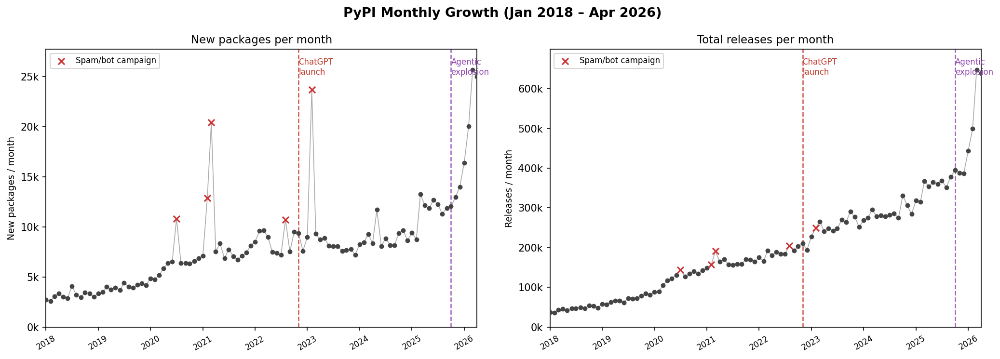
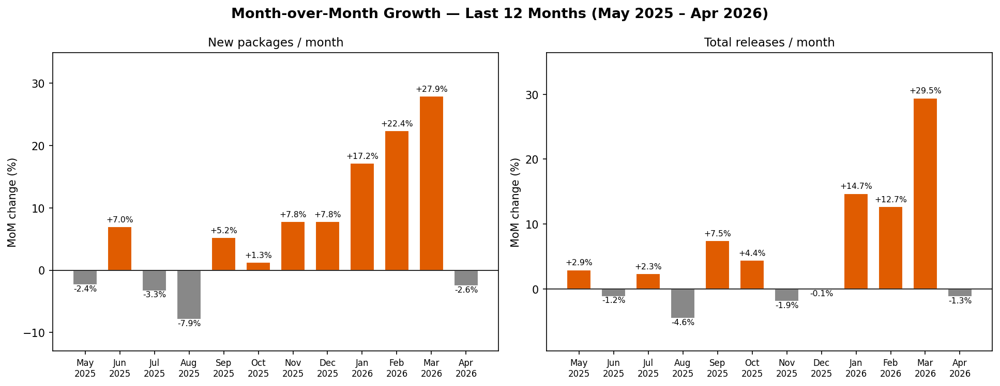

# Does Agentic Coding Accelerate PyPI Growth?

**TL;DR** — The agentic coding explosion is clearly visible in PyPI data. Starting October 2025, both the number of new packages and the release frequency break from their long-term trend in a statistically significant way (p < 10⁻¹⁵).

We analyze all PyPI upload metadata from January 2018 to April 2026 (~22 million records) using two monthly metrics: the number of new packages created and the total number of releases. We apply a Chow structural break test at October 2025 — the onset of the agentic AI coding wave — to test whether the long-term growth trend changed significantly at that point.

Both metrics show a statistically significant break (p < 10⁻¹⁵). The monthly growth slope for new packages increased by +3,040% and for total releases by +1,537% after October 2025. As of early 2026, PyPI is receiving over 20,000 new packages and half a million releases every month — figures that would have seemed implausible just two years ago.

```bibtex
@misc{monperrus2026pypi,
  author = {Monperrus, Martin},
  title  = {Does Agentic Coding Accelerate PyPI Growth?},
  year   = {2026},
  url    = {https://github.com/monperrus/experiment-pypi-growth}
}
```

## Results

### Monthly time series

For each month from January 2018 to April 2026 we plot two series extracted from the PyPI BigQuery dataset: the count of packages making their first-ever upload, and the total count of all uploads. Two reference lines mark the ChatGPT launch (November 2022) and the agentic explosion (October 2025). Months flagged as spam/bot campaigns are shown as × and excluded from the regression.



*Dashed lines: ChatGPT launch (Nov 2022, red) and agentic explosion (Oct 2025, purple). × markers: spam/bot campaign months. Data: [`data_new_packages_monthly.csv`](data_new_packages_monthly.csv), [`data_releases_monthly.csv`](data_releases_monthly.csv)*

Both series grow steadily from 2018 onward. New package creation is noisier — punctuated by the spam spikes — while the releases series is smoother and shows a cleaner continuous acceleration. A sharp break is visible starting around October 2025 in both panels, driving the 2026 values far above the preceding trend. A secondary signal worth noting: the median number of releases per year per active package has stayed flat at 4 across 2018, 2024, and 2025 — the typical package has not changed its release cadence. The growth in total releases is explained by two factors: far more active packages (63k in 2018 → 224k in 2025) and a much fatter upper tail (p99: 77 releases/year in 2018 → 260 in 2024). High-frequency releasers have accelerated significantly while the median package remains unchanged.

### Month-over-month growth — last 12 months

For each of the 12 months from May 2025 to April 2026 we compute the percentage change relative to the previous month for both metrics. This zooms into the most recent period to show the within-year dynamics and the timing of the acceleration.

The table below shows November values across selected years for direct comparison.

| Month | New packages | Releases |
|-------|-------------|---------|
| 2018-11 | 3,333 | 53,432 |
| 2021-11 | 7,416 | 168,956 |
| 2024-11 | 9,660 | 306,096 |
| 2025-11 | 12,972 | 387,431 |
| 2026-02 | 20,055 | 500,102 |
| 2026-03 | 25,651 | 647,395 |
| 2026-04 | 24,996 | 639,282 |



*Data: [`data_mom_last12.csv`](data_mom_last12.csv)*

The bars oscillate near zero through mid-2025 with no persistent direction, then break sharply upward in January 2026 and sustain +17–28% for new packages and +13–30% for releases over three consecutive months before retreating in April. The acceleration is not a transient spike: the underlying baseline had already risen steadily throughout 2025, as confirmed by the statistical test below.

### Statistical test

The Chow test detects a structural break in a linear time trend at a specified date: it fits separate regression lines to the pre- and post-break periods and tests via an F-statistic whether the two segments are drawn from the same model. Here the break is set at October 2025 (agentic explosion), and outlier months are excluded. With k = 2 parameters per segment and n = 95 clean observations (89 pre, 6 post), the statistic follows F(2, 91).

Both metrics show a highly significant break. The monthly growth slope for new packages increases from +90 to +2,822 per month (+3,040%), and for releases from +3,659 to +59,911 per month (+1,537%). Both F-statistics hit the numerical floor of scipy's F distribution (p = 1.1 × 10⁻¹⁶).

| Metric | Pre slope (89 mo) | Pre R² | Post slope (6 mo) | Post R² | Slope change | F(2,91) | p |
|--------|------------------|--------|------------------|---------|-------------|---------|---|
| New packages | +90 /mo | 0.854 | +2,822 /mo | 0.932 | +3,040% | 167.9 | 1.1 × 10⁻¹⁶ \*\*\* |
| Total releases | +3,659 /mo | 0.975 | +59,911 /mo | 0.901 | +1,537% | 210.4 | 1.1 × 10⁻¹⁶ \*\*\* |

\* p<0.05  \*\* p<0.01  \*\*\* p<0.001

## Data

Source: [BigQuery public dataset `bigquery-public-data.pypi.distribution_metadata`](https://console.cloud.google.com/marketplace/product/gcp-public-data-pypi/pypi), containing all PyPI upload metadata (~22 million records as of May 2026). Date range: January 2018 – April 2026 (100 months).

- [`data_new_packages_monthly.csv`](data_new_packages_monthly.csv) — monthly count of packages making their first-ever upload
- [`data_releases_monthly.csv`](data_releases_monthly.csv) — monthly count of all uploads (all packages, all versions)
- [`data_mom_last12.csv`](data_mom_last12.csv) — month-over-month percentage change for the last 12 months

## Method

### Outlier flagging

Five months are marked as likely spam/typosquatting campaigns — single-month spikes 3–4× above adjacent months, a well-documented attack pattern on PyPI. They are excluded from the regression and shown as × markers in the time series. Release counts are far less affected (spam packages have minimal release counts). The 2026 acceleration months are not flagged: they show sustained high values across consecutive months rather than isolated single-month spikes.

| Month | New packages | Notes |
|-------|-------------|-------|
| 2020-07 | 10,809 | Isolated spike |
| 2021-02 | 12,846 | Start of 2-month campaign |
| 2021-03 | 20,409 | Peak of 2021 campaign |
| 2022-08 | 10,714 | Isolated spike |
| 2023-02 | 23,704 | Largest pre-2025 spike |

## Reproduction

```bash
# Requires BigQuery access (bq CLI) and Python 3 with numpy/scipy/matplotlib
bq query --use_legacy_sql=false --format=csv "
SELECT DATE_TRUNC(DATE(min_upload_time), MONTH) AS month, COUNT(*) AS new_packages
FROM (SELECT name, MIN(upload_time) AS min_upload_time FROM \`bigquery-public-data.pypi.distribution_metadata\` GROUP BY name)
WHERE DATE(min_upload_time) >= '2018-01-01'
GROUP BY month ORDER BY month"

python3 analyze.py
```

