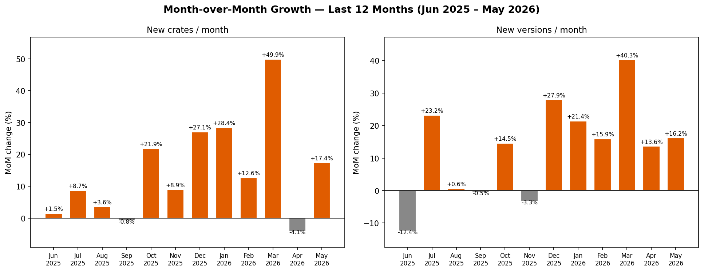

# Does Agentic Coding Accelerate Cargo/crates.io Growth?

**TL;DR** — The agentic coding explosion is clearly visible in crates.io data. Starting October 2025, both the number of new crates and the version release frequency break from their long-term trend in a statistically significant way (p < 10⁻¹⁵).

We analyze all crates.io upload metadata from January 2018 to May 2026 (~290k crates, ~2.5M versions) using two monthly metrics: the number of new crates created and the total number of new versions published. We apply a Chow structural break test at October 2025 — the onset of the agentic AI coding wave — to test whether the long-term growth trend changed significantly at that point.

Both metrics show a statistically significant break (p < 10⁻¹⁵). The monthly growth slope for new crates increased by +5,237% and for new versions by +4,345% after October 2025. As of early 2026, crates.io is receiving over 16,000 new crates and 150,000 new versions every month.

```bibtex
@misc{monperrus2026cargo,
  author = {Monperrus, Martin},
  title  = {Does Agentic Coding Accelerate Cargo/crates.io Growth?},
  year   = {2026},
  url    = {https://github.com/monperrus/experiment-rust-growth}
}
```

## Results

### Monthly time series

For each month from January 2018 to May 2026 we plot two series extracted from the crates.io database dump: the count of crates making their first-ever publish, and the total count of all new (non-yanked) version publications. Two reference lines mark the ChatGPT launch (November 2022) and the agentic explosion (October 2025).


*Dashed lines: ChatGPT launch (Nov 2022, red) and agentic explosion (Oct 2025, purple). Regression lines show pre- (green) and post-break (orange) trends. Data: [`data_new_crates_monthly.csv`](data_new_crates_monthly.csv), [`data_versions_monthly.csv`](data_versions_monthly.csv)*

Both series grow steadily through 2018–2025 before sharply accelerating. The pre-trend for new crates is a tight linear fit (R²=0.936) growing at +36 crates/month; the post-break slope jumps to +1,927/month. Versions follow a similarly clean pre-trend (+409/month, R²=0.925) before accelerating to +18,170/month.

### Month-over-month growth — last 12 months

For each of the 12 months from June 2025 to May 2026 we compute the percentage change relative to the previous month for both metrics.

| Month | New crates | New versions |
|-------|-----------|--------------|
| 2025-01 | 2,185 | 18,748 |
| 2025-06 | 2,527 | 23,033 |
| 2026-01 | 8,660 | 70,879 |
| 2026-02 | 9,755 | 82,137 |
| 2026-03 | 14,620 | 115,203 |
| 2026-04 | 14,016 | 130,912 |
| 2026-05 | 16,453 | 152,114 |



*Data: [`data_mom_last12.csv`](data_mom_last12.csv)*

### Statistical test

| Metric | Pre slope (94 mo) | Pre R² | Post slope (7 mo) | Post R² | Slope change | F(2,97) | p |
|--------|------------------|--------|------------------|---------|-------------|---------|---|
| New crates | +36 /mo | 0.936 | +1,927 /mo | 0.952 | +5,237% | 1497.8 | 1.1 × 10⁻¹⁶ \*\*\* |
| New versions | +409 /mo | 0.925 | +18,170 /mo | 0.976 | +4,345% | 1046.7 | 1.1 × 10⁻¹⁶ \*\*\* |

\* p<0.05  \*\* p<0.01  \*\*\* p<0.001

The F-statistics (1,498 and 1,047) are an order of magnitude larger than the equivalent PyPI figures (168 and 210), suggesting the structural break is even more pronounced in the Rust ecosystem — possibly because Rust's developer community, while smaller, adopted agentic tooling rapidly and crates.io had a lower pre-existing baseline to break from.

## Data

Source: [crates.io database dump](https://static.crates.io/db-dump.tar.gz), containing all crate and version metadata. Yanked versions are excluded from the version count.

- [`data_new_crates_monthly.csv`](data_new_crates_monthly.csv) — monthly count of crates making their first-ever publish
- [`data_versions_monthly.csv`](data_versions_monthly.csv) — monthly count of new (non-yanked) version publications
- [`data_mom_last12.csv`](data_mom_last12.csv) — month-over-month percentage change for the last 12 months

Large intermediate files are intentionally not committed:

- `db-dump.tar.gz`
- `crates_raw.csv`
- `versions_raw.csv`

Regenerate all three by running `python3 fetch_data.py` in this directory.

## Reproduction

```bash
# Download the crates.io dump and recreate:
#   db-dump.tar.gz
#   crates_raw.csv
#   versions_raw.csv
#   data_new_crates_monthly.csv
#   data_versions_monthly.csv
# (~3 GB disk, ~10 min)
python3 fetch_data.py

# Recompute data_mom_last12.csv and regenerate all PNG figures
python3 analyze.py
```

Requires Python 3 with numpy, scipy, matplotlib.
